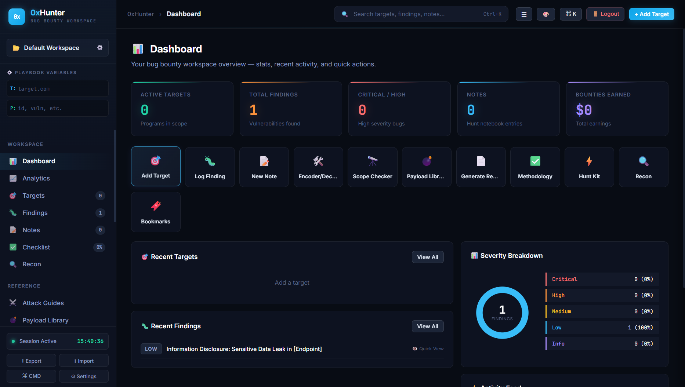

# 0xHunter 🎯

0xHunter is an advanced, premium-designed collaborative workspace for bug bounty hunters and ethical hackers. It consolidates targets, vulnerability findings, note-taking, checklists, passive OSINT tools, and forensic metadata extractors into a single, beautiful web dashboard.

---

## 📸 Preview & Screenshots

Add your application screenshots here to showcase the sleek UI! 

> [!TIP]
> Place your images in a new folder like `docs/images/` (e.g., `docs/images/dashboard.png`) and update the image sources below.

<!-- Screenshot Carousel / Showcase -->
<p align="center">
  
</p>

<p align="center">
  
  &nbsp;&nbsp;
  
</p>

---

## 🚀 Key Features

* 💻 **Premium Dashboard**: Real-time overview of active targets, findings count, session tracking, and recent activity logs.
* 🧬 **Passive OSINT Hub**: Passive DNS lookup (via Cloudflare DoH), WHOIS (via RDAP), quick port scanners, and username search proxies (checking 20+ social platforms).
* 🖼️ **Forensic EXIF Extractor**: Dual JPEG and PNG metadata analyzer extracting camera tags, capture timestamps, software details, and embedding interactive dark-mode maps for GPS coordinates.
* 📚 **Methodology Checklist**: A built-in tracking dashboard pre-loaded with 70+ methodology steps across 6 categories.
* 📝 **Autosaving Notes**: Rich recon notepad with auto-save timers, filtering, search, and category tags.
* 🛠️ **Hacking Kit & Helpers**: Subdomain generators, URL deduplicators, encoders/decoders, cookie parsers, security header checkers, and customized Google/Shodan dork queries.

---

## 🛠️ Installation & Setup

Follow these steps to set up and run 0xHunter locally:

### 1. Prerequisite
Ensure you have **Python 3.10+** installed on your system.

### 2. Clone the Repository
```bash
git clone https://github.com/sanketjaybhaye/0xHunter.git
cd 0xHunter
```

### 3. Set Up Virtual Environment & Dependencies
Choose the appropriate command for your operating system:

#### For Windows:
```powershell
python -m venv .venv
.venv\Scripts\activate
pip install -r requirements.txt
```

#### For Linux / macOS:
```bash
python3 -m venv .venv
source .venv/bin/activate
pip install -r requirements.txt
```

### 4. Initialize Database & Generate Admin User
Initialize the SQLite tables and generate your secure administrator account:
```bash
python init_db.py
python scripts/create_admin.py admin your-secure-password
```

---

## 🏃 Running the Application

### Development Server
Start the Flask development server:

#### Windows (PowerShell):
```powershell
$env:FLASK_DEBUG="1"
python app.py
```

#### Linux / macOS:
```bash
export FLASK_DEBUG=1
python app.py
```

Open [http://127.0.0.1:5000](http://127.0.0.1:5000) in your browser and sign in with the admin credentials you created.

---

## 🛡️ Production Deployment

For production usage, run behind a reverse proxy (e.g., Nginx, Caddy) using an WSGI server like **gunicorn**:

```bash
export SECRET_KEY="generate-a-long-random-cryptographic-string-here"
export FLASK_DEBUG=0
gunicorn -w 2 -b 0.0.0.0:5000 app:app
```

> [!IMPORTANT]
> The database tracks the workspace collaboratively (all logged-in users share workspace state). Keep the `SECRET_KEY` environment variable secret in production.

---

## 📂 Repository Structure

```text
0xHunter/
├── data/                  # Ignored by git (stores local SQLite DBs & session keys)
├── scripts/
│   └── create_admin.py    # Admin account creation helper
├── static/
│   ├── css/               # Sleek CSS styling
│   └── js/                # App controllers, OSINT tools, & EXIF scanner logic
├── templates/
│   ├── index.html         # Main dashboard layout
│   └── login.html         # Authentication interface
├── README.md
├── app.py                 # Core Flask backend routes
├── init_db.py             # Database structure definition
└── requirements.txt       # Project python dependencies
```
